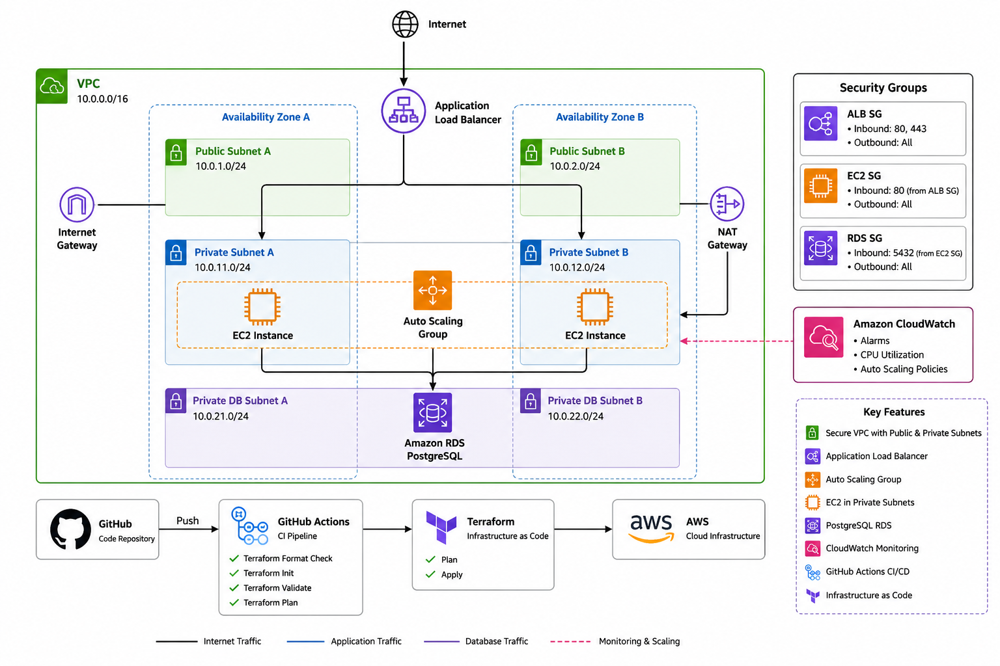

# Enterprise AWS Secure Landing Zone

A production-inspired AWS infrastructure built with Terraform following Infrastructure as Code (IaC) best practices.

This project provisions a secure and scalable AWS environment featuring private networking, load balancing, auto scaling, monitoring, and a PostgreSQL database.


## Project Overview

This project demonstrates the deployment of a secure and scalable AWS infrastructure using Terraform.

The architecture follows Infrastructure as Code (IaC) principles and incorporates networking, compute, load balancing, auto scaling, monitoring, IAM, and managed database services while following AWS best practices.

## Features

- Custom VPC with Public and Private Subnets
- Internet Gateway and NAT Gateway
- Secure Security Groups
- EC2 Launch Template
- Application Load Balancer (ALB)
- Auto Scaling Group
- CloudWatch Scaling Policies
- PostgreSQL RDS Database
- IAM Roles and Instance Profiles
- GitHub Actions CI Pipeline
- Infrastructure as Code using Terraform


## Architecture



## AWS Services Used

- Amazon VPC
- Amazon EC2
- Application Load Balancer
- Auto Scaling Group
- Amazon RDS PostgreSQL
- CloudWatch
- IAM
- Internet Gateway
- NAT Gateway
- Security Groups
- Terraform
- GitHub Actions

## CI/CD Pipeline

This project uses GitHub Actions to automatically validate Terraform code on every push and pull request.

The pipeline performs:

- Terraform Format Check (`terraform fmt -check`)
- Terraform Initialization (`terraform init`)
- Terraform Validation (`terraform validate`)
- Terraform Execution Plan (`terraform plan`)

This ensures infrastructure changes are validated before deployment.


## Project Structure

```text
Enterprise-aws-secure-landing-zone
│
├── .github/
│   └── workflows/
│       └── terraform.yml
│
├── keys/
│
├── terraform/
│   ├── alb.tf
│   ├── autoscaling.tf
│   ├── cloudwatch.tf
│   ├── db.tf
│   ├── ec2.tf
│   ├── iam.tf
│   ├── networking.tf
│   ├── outputs.tf
│   ├── provider.tf
│   ├── security_groups.tf
│   ├── variables.tf
│   └── ...
│
└── README.md
```


## Deployment

Clone the repository

```bash
git clone https://github.com/iizScareyy/Enterprise-aws-secure-landing-zone.git

Navigate to Terraform directory

```bash
cd terraform
```

Initialize Terraform

```bash
terraform init
```

Validate configuration

```bash
terraform validate
```

Review execution plan

```bash
terraform plan
```

Deploy infrastructure

```bash
terraform apply
```


## Cleanup

Destroy all infrastructure

```bash
terraform destroy
```

## Author

**Shraddha**

- AWS Certified Solutions Architect – Associate (SAA-C03)
- GitHub: https://github.com/iizScareyy